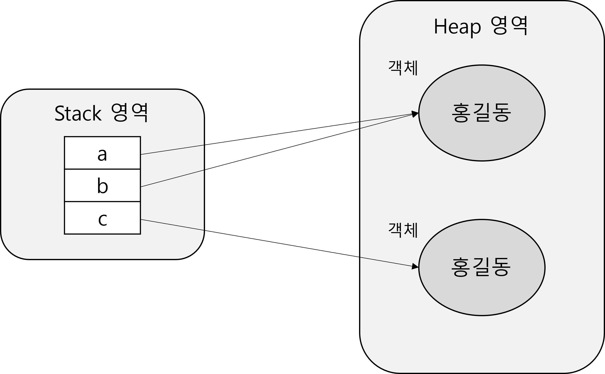

# Chapter 2. 연산자

## 2.1 연산자와 연산식

### 2.1.1 연산자와 연산식

- 연산
    - 프로그램에서 데이터를 처리하여 결과를 산출하는 것
- 연산자
    - 연산에서 사용되는 표시나 기호
    - 필요로 하는 변수의 수에 따라 단항, 이항, 삼항으로 구분
- 연산식
    - 연산자와 변수를 이용하여 연산의 과정을 기술한 것
    - 반드시 하나의 값만 산출

## 2.2 연산의 방향과 우선순위

### 2.2.1 연산의 방향과 우선순위

- 연산의 방향
    1. 단항, 이항, 삼항 연산자 순으로 우선순위를 가짐
    2. 산술, 비교, 논리, 대입 연산자 순으로 우선순위를 가짐
    3. 단항과 대입을 제외한 모든 연산의 방향은 왼쪽에서 오른쪽으로
    4. 복잡한 연산식은 괄호로 묶어 우선순위를 정해줌

## 2.3 단항 연산자

### 2.3.1 부호 연산자(+, -)

- 부호 연산자
    - 양수 및 으수를 표시하는 연산자
    - `boolean` 타입과 `char` 타입을 제외한 나머지 타입에 사용 가능
    - 변수 앞에 사용되는 경우 변수 값의 부호를 유지하거나 바꾸기 위해 사용
    - 산출 타입은 `int` 타입
      
        ⇒ `short` 타입 값에 부호 연산을 하면 `int` 타입으로 바뀜
    
- 부호 연산자 예제
  
    ```java
    package sec03;
    
    public class SignOperatorTest {
    
    	public static void main(String[] args) {
    
    		int x = -100;
    		int result1 = +x;
    		int result2 = -x;
    		System.out.println("result1=" + result1);
    		System.out.println("result2=" + result2);
    
    		short s = 100;
    		// short result3 = -s; //컴파일 에러
    		int result3 = -s;
    		System.out.println("result3=" + result3);
    
    	}
    
    }
    ```
    
    - 결과
      
        ```
        result1=-100
        result2=100
        result3=-100
        ```
        

### 2.3.2 증감 연산자(++, - -)

- 증감 연산자
    - 변수의 값을 1 증가시키거나 1 감소시키는 연산자
    - `boolean` 타입을 제외한 모든 변수에 적용 가능
    - 종류 : `++`, `--`
    - 증감연산자가 변수보다 먼저 쓰이면 1을 증감한 후 변수 값을 취함
    - 증감연산자가 변수보다 나중에 쓰이면 변수 값을 취한 후 증감
    - 증감 연산자나 직접 증감을 하는 연산자나 컴파일하면 동일한 바이트 코드 생성
      
        ⇒ 둘 다 속도는 비슷
    
- 증감 연산자 예제
  
    ```java
    package sec03;
    
    public class IncreaseDecreaseOperatorTest {
    
    	public static void main(String[] args) {
    
    		int x = 10;
    		int y = 10;
    		int z;
    
    		System.out.println("-----------------------");
    		x++;
    		++x;
    		System.out.println("x=" + x);
    
    		System.out.println("-----------------------");
    		y--;
    		--y;
    		System.out.println("y=" + y);
    
    		System.out.println("-----------------------");
    		z = x++;
    		System.out.println("z=" + z);
    		System.out.println("x=" + x);
    
    		System.out.println("-----------------------");
    		z = ++x;
    		System.out.println("z=" + z);
    		System.out.println("x=" + x);
    
    		System.out.println("-----------------------");
    		z = ++x + y++;
    		System.out.println("z=" + z);
    		System.out.println("x=" + x);
    		System.out.println("y=" + y);
    
    	}
    
    }
    ```
    
    - 결과
      
        ```
        -----------------------
        x=12
        -----------------------
        y=8
        -----------------------
        z=12
        x=13
        -----------------------
        z=14
        x=14
        -----------------------
        z=23
        x=15
        y=9
        ```
        

### 2.3.3 논리 부정 연산자(!)

- 논리 부정 연산자
    - `true`는 `false`로, `false`는 `true`로 변경하는 연산자
    - `boolean` 타입에만 사용 가능
    - 상태를 번갈아가며 변경하는 토글 기능 구현 시 주로 사용
- 논리 부정 연산자 예제
  
    ```java
    package sec03;
    
    public class LogicDenyOperatorTest {
    
    	public static void main(String[] args) {
    
    		boolean play = true;
    		System.out.println(play);
    
    		play = !play;
    		System.out.println(play);
    
    		play = !play;
    		System.out.println(play);
    
    	}
    
    }
    ```
    
    - 결과
      
        ```java
        true
        false
        true
        ```
        

### 2.3.4 비트 반전 연산자(~)

- 비트 반전 연산자
    - 정수 타입 변수에만 사용
    - 변수를 2진수로 표현했을 때 비트 값을 0은 1로, 1은 0으로 반전하는 연산자
    - 부호 비트까지 반전되어 부호가 반대인 값이 산출됨
    - 산출 결과는 `int`로 산출되고, 연산 수행 전 `int`타입으로 변환 후 반전이 일어남
      
        ⇒ 아래의 경우 컴파일 에러 발생
        
        ```java
        byte a = 10;
        byte b = ~a; // 컴파일 에러
        int c = ~a; // 가능
        ```
        
    - 비트 반전 연산자의 산출값에 1을 더하면 부호가 반대인 정수 값을 얻을 수 있음
- 비트 반전 연산자 예제
  
    ```java
    package sec03;
    
    public class BitReverseOperatorTest {
    
    	public static void main(String[] args) {
    
    		int v1 = 10;
    		int v2 = ~v1;
    		int v3 = ~v1 + 1;
    
    		System.out.println(toBinaryString(v1) + " (십진수: " + v1 + ")");
    		System.out.println(toBinaryString(v2) + " (십진수: " + v2 + ")");
    		System.out.println(toBinaryString(v3) + " (십진수: " + v3 + ")");
    		System.out.println();
    
    		int v4 = -10;
    		int v5 = ~v4;
    		int v6 = ~v4 + 1;
    
    		System.out.println(toBinaryString(v4) + " (십진수: " + v4 + ")");
    		System.out.println(toBinaryString(v5) + " (십진수: " + v5 + ")");
    		System.out.println(toBinaryString(v6) + " (십진수: " + v6 + ")");
    
    	}
    
    	public static String toBinaryString(int value) {
    
    		String str = Integer.toBinaryString(value);
    
    		while (str.length() < 32) {
    			str = "0" + str;
    		}
    
    		return str;
    	}
    
    }
    ```
    
    - 결과
      
        ```
        00000000000000000000000000001010 (십진수: 10)
        11111111111111111111111111110101 (십진수: -11)
        11111111111111111111111111110110 (십진수: -10)
        
        11111111111111111111111111110110 (십진수: -10)
        00000000000000000000000000001001 (십진수: 9)
        00000000000000000000000000001010 (십진수: 10)
        ```
        

## 2.4 이항 연산자

### 2.4.1 산술 연산자

- 산술 연산자
    - 사칙연산에 나머지를 구하는 연산자를 포함해서 총 5개
    - 종류
      
      
        | 연산자 | 의미 |
        | --- | --- |
        | + | 더하기 |
        | - | 빼기 |
        | * | 곱하기 |
        | / | 나눈 후 몫 취하기 |
        | % | 나눈 후 나머지 취하기 |
    - 연산식에 포함된 변수들의 타입이 동일하지 않을 경우 수행 규칙
        1. 변수들이 모두 정수 타입이고, `int` 타입보다 작은 타입일 경우 : 모두 `int`로 변환 후 수행
           
            ⇒ 산출 결과 : `int`
            
        2. 변수들이 모두 정수 타입이고, `long` 타입이 있을 경우 : 모두 `long` 타입으로 변환 후 수행
           
            ⇒ 산출 결과 : `long`
            
        3. 변수 중 실수 타입이 있는 경우 : 크기가 큰 실수 타입으로 변환 후 수행
           
            ⇒ 산출 결과 : 크기가 큰 실수 타입
        
    - 정수 타입 연산의 결과가 `int`타입으로 나오는 이유 : JVM이 기본적으로 32비트로 계산하기 때문
    - 나누기 연산의 결과가 실수 타입이어도 연산식에 포함된 변수들이 정수 타입이면 소수점은 버려짐
- 산술 연산자 예제
    1. 예제 1
       
        ```java
        package sec04;
        
        public class ArithmeticOperatorTest {
        
        	public static void main(String[] args) {
        
        		int a = 5;
        		int b = 3;
        
        		int result1 = a + b;
        		System.out.println(result1);
        
        		int result2 = a - b;
        		System.out.println(result2);
        
        		int result3 = a * b;
        		System.out.println(result3);
        
        		int result4 = a / b; // 정확한 값은 1.66X이지만 정수 타입으로 산출되어 1이 출력됨
        		System.out.println(result4);
        
        		int result5 = a % b;
        		System.out.println(result5);
        
        		double result6 = (double) a / b; // 실수 타입의 형변환이 이루어져 실수 타입인 1.66X로 출력됨
        		System.out.println(result6);
        
        	}
        
        }
        ```
        
        - 결과
          
            ```
            8
            2
            15
            1
            2
            1.6666666666666667
            ```
        
    2. 예제 2 - char 타입 연산
       
        ```java
        package sec04;
        
        public class ArithmeticOperatorTest2 {
        
        	public static void main(String[] args) {
        
        		char c1 = 'A' + 1;
        		char c2 = 'A';
        //		char c3 = c2 + 1; // 1과 연산되기 때문에 int 타입으로 산출되어야 함
        		char c3 = (char) (c2 + 1);
        		
        		System.out.println(c1);
        		System.out.println(c2);
        		System.out.println(c3);
        
        	}
        
        }
        ```
        
        - 결과
          
            ```
            B
            A
            B
            ```
    
- 오버플로우 탐지
    - 산술 연산 시 주의할 점 : 산출값이 산출 타입으로 표현 가능한가
    - 산출 값이 산출 타입으로 표현할 수 없는 값이면 오버플로우가 발생하고 쓰레기 값을 얻을 수 있음
- 오버플로우 예제
    1. 예제 1 - 오버플로우
       
        ```java
        package sec04;
        
        public class OverflowTest1 {
        
        	public static void main(String[] args) {
        
        		int a = 1000000;
        		int b = 1000000;
        		int c = a * b; // 컴파일 에러는 나지 않지만 쓰레기값 출력
        
        		System.out.println(c);
        
        	}
        
        }
        ```
        
        - 결과
          
            ```
            -727379968
            ```
        
    2. 예제 2 - 오버플로우 해결
       
        ```java
        package sec04;
        
        public class OverflowTest2 {
        
        	public static void main(String[] args) {
        
        		int a = 1000000;
        		long b = 1000000l; // a나 b 중 하나라도 long이어야 함
        		long c = a * b;
        
        		System.out.println(c);
        
        	}
        
        }
        ```
        
        - 결과
          
            ```
            1000000000000
            ```
        
    3. 예제 3 - 오버플로우 탐지
       
        ```java
        package sec04;
        
        public class OverflowTest3 {
        
        	public static void main(String[] args) {
        
        		try {
        
        			int result = safeAdd(2000000000, 2000000000); // static이라 객체 생성 불필요
        
        			System.out.println(result);
        
        		} catch (ArithmeticException e) {
        
        			System.out.println("오버플로우 발생하여 계산 불가");
        
        		}
        
        	}
        
        	public static int safeAdd(int left, int right) {
        
        		if (right > 0) {
        			if (left > (Integer.MAX_VALUE - right)) {
        				throw new ArithmeticException("오버플로우 발생"); // 합이 범위를 초과하는 경우 오버플로우 발생
        			}
        		} else {
        			if (left < (Integer.MIN_VALUE - right)) {
        				throw new ArithmeticException("오버플로우 발생"); // 합이 범위에 미치지 못하는 경우 오버플로우 발생
        			}
        		}
        
        		return left + right;
        
        	}
        
        }
        ```
        
        - 결과
          
            ```
            오버플로우 발생하여 계산 불가
            ```
    
- 정확한 계산
    - 정확하게 계산해야 할 때는 실수 타입을 사용하지 않는 것이 좋음
    - 이진 포맷의 가수를 사용하는 실수 타입은 0.1을 정확히 표현할 수 없어 근사치로 처리
    - 연산 결과를 출력할 때 실수 타입으로 출력
- 정확한 계산 예제
    1. 예제 1 - 실수 타입으로 연산하는 경우
       
        ```java
        package sec04;
        
        public class AccuracyOperationTest1 {
        
        	public static void main(String[] args) {
        
        		int total = 1;
        		double unit = 0.1;
        		int piece = 7;
        		
        		double remain = total - unit * piece;
        		
        		System.out.println("전체에서 " + remain + "만 남음");
        		
        	}
        
        }
        ```
        
        - 결과
          
            ```
            전체에서 0.29999999999999993만 남음
            ```
        
    2. 예제 2 - 정수 타입으로 연산 한 후 출력만 실수 타입으로 한 경우
       
        ```java
        package sec04;
        
        public class AccuracyOperationTest2 {
        
        	public static void main(String[] args) {
        
        		int total = 1;
        		int totalInt = total * 10;
        		int piece = 7;
        
        		double remain = (totalInt - piece) / 10.0;
        
        		System.out.println("전체에서 " + remain + "만 남음");
        
        	}
        
        }
        ```
        
        - 결과
          
            ```
            전체에서 0.3만 남음
            ```
    
- NaN과 Infinity 연산
    - 나누기 관련 연산을 수행할 때 나누는 수를 0으로 하면 안됨
    - 나누는 수를 0으로 하면 컴파일은 되지만, 예외(ArithmeticException) 발생
    - 자바는 예외가 발생하면 즉시 프로그램 종료됨
      
        ⇒ 예외 발생 시 예외 처리를 해야 함
        
    - 나누는 수를 0.0(실수 타입)으로 나누면 예외가 발생하지 않음
        - `/` 연산자의 경우 : Infinity 값을 가짐
        - `%` 연산자의 경우 : NaN(Not a Number)
    - Infinity나 NaN이 산출 결과로 나온 후 연산을 이어서 진행하면 어떤 수와 연산하여도 Infinity나 NaN이 산출되어 데이터가 엉망이 됨
        - 확인 메소드 : `Double.isInfinite`, `Double.isNaN`
- NaN과 Infinity 예제
  
    ```java
    package sec04;
    
    public class InfinityAndNaNTest {
    
    	public static void main(String[] args) {
    
    		int x = 5;
    		double y = 0.0;
    
    		double z = x / y;
    		// double z = x % y;
    
    		System.out.println(Double.isInfinite(z));
    		System.out.println(Double.isNaN(z));
    
    		// 잘못된 코드
    		System.out.println(z + 2);
    
    		// 알맞은 코드
    		if (Double.isInfinite(z) || Double.isNaN(z)) {
    
    			System.out.println("값 산출 불가");
    
    		} else {
    
    			System.out.println(z + 2);
    
    		}
    
    	}
    
    }
    ```
    
    - 결과
      
        ```
        true
        false
        Infinity
        값 산출 불가
        ```
        

### 2.4.2 문자열 연결 연산자(+)

- 문자열 연결 연산자
    - `+`는 문자열을 서로 결합하는 연산자로도 적용
    - 한쪽이 문자열이면 다른 쪽 변수도 문자열로 변환하여 결합
    - 예시
      
        ```
        String str1 = "char" + 59;
        // 59는 정수형이지만 문자열로 변환되어 "char59"라는 문자열이 출력됨
        
        3 + 3 + "char"; // "6char"출력 --> 순서가 중요함
        ```
    
- 문자열 연결 연산자 예제
  
    ```java
    package sec04;
    
    public class StringConcatTest {
    
    	public static void main(String[] args) {
    
    		String str1 = "JDK" + 6.0;
    		String str2 = str1 + " 특징";
    		
    		System.out.println(str2);
    		
    		String str3 = "JDK" + 3 + 3.0;
    		String str4 = 3 + 3.0 + "JDK";
    		
    		System.out.println(str3);
    		System.out.println(str4);	
    		
    	}
    
    }
    ```
    
    - 결과
      
        ```
        JDK6.0 특징
        JDK33.0
        6.0JDK
        ```
        

### 2.4.3 비교 연산자

- 비교 연산자
    - 대소 또는 동등을 비교해서 `boolean` 타입 결과값 산출
    - 대소 연산자는 `boolean` 타입 제외 모든 기본형 변수 적용 가능
    - 동등 연산자는 모든 타입 변수 적용 가능
    - 종류
      
      
        | 구분 | 연산자 | 의미 |
        | --- | --- | --- |
        | 동등 | == | 같은지 검사 |
        | 동등 | != | 다른지 검사 |
        | 대소 | > | 왼쪽이 큰지 점사 |
        | 대소 | >= | 왼쪽이 크거나 같은지 검사 |
        | 대소 | < | 오른쪽이 큰지 검사 |
        | 대소 | <= | 오른쪽이 크거나 같은지 검사 |
    - 실수 타입은 동일한 타입으로 변환한 후 수행해야 정확한 결과를 얻을 수 있음
    - `String` 타입의 문자열은 대소 연산자는 사용할 수 없고 동등 연산자만 가능
    - `String` 타입은 동등 연산자가 값이 같은지를 판별하는 것이 아니라 주소가 같은지 판별
    - 문자열 내용을 비교하려면 `equals()` 메소드를 사용해야 함
    - `String` 예시
      
        ```java
        String a = "홍길동";
        String b = "홍길동";
        String c = new String("홍길동");
        
        // a와 b는 같은 주소 값을 가짐
        // c는 새로운 주소 값을 가짐
        
        a == b // true
        a == c // false
        ```
        
        
    
- 비교 연산자 예제
    1. 예제 1
       
        ```java
        package sec04;
        
        public class CompareOperatorTest1 {
        
        	public static void main(String[] args) {
        
        		int num1 = 10;
        		int num2 = 10;
        
        		boolean result1 = (num1 == num2);
        		boolean result2 = (num1 != num2);
        		boolean result3 = (num1 <= num2);
        
        		System.out.println(result1);
        		System.out.println(result2);
        		System.out.println(result3);
        
        		char char1 = 'A';
        		char char2 = 'B';
        
        		boolean result4 = (char1 < char2); // 'A'는 65, 'B'는 66으로 입력되어 비교 수행
        
        		System.out.println(result4);
        
        	}
        
        }
        ```
        
        - 결과
          
            ```
            true
            false
            true
            true
            ```
        
    2. 예제 2 - 실수 타입
       
        ```java
        package sec04;
        
        public class CompareOperatorTest2 {
        
        	public static void main(String[] args) {
        
        		int a = 1;
        		double b = 1.0;
        		
        		System.out.println(a == b); //true
        		
        		double c = 0.1;
        		float d = 0.1f;
        		System.out.println(c == d); //false
        		System.out.println((float)c == d); //true
        		System.out.println((int)(c*10) == (int)(d*10)); //true
        
        	}
        
        }
        ```
        
        - 결과
          
            ```
            true
            false
            true
            true
            ```
        
    3. 예제 3 - 문자열 비교 예제
       
        ```java
        package sec04;
        
        public class CompareOperatorTest3 {
        
        	public static void main(String[] args) {
        
        		String str1 = "홍길동";
        		String str2 = "홍길동";
        		String str3 = new String("홍길동");
        		
        		System.out.println(str1 == str2);
        		System.out.println(str1 == str3);
        		
        		System.out.println("");
        		
        		System.out.println(str1.equals(str2));
        		System.out.println(str1.equals(str3));
        		
        	}
        
        }
        ```
        
        - 결과
          
            ```
            true
            false
            
            true
            true
            ```
            

### 2.4.4 논리 연산자

- 논리 연산자
    - 논리곱, 논리합, 배타적 논리합, 논리 부정 연산 수행
    - `boolean` 타입 변수만 가능
    - 종류
      
      
        | 구분 | 연산식 | 의미 |
        | --- | --- | --- |
        | AND | &&, & | 둘 다 true여야 true |
        | OR | ||, | | 둘 중 하나만 true여도 true |
        | XOR | ^ | 둘의 결과가 반대여야 true |
        | NOT | ! | 값을 반대로 바꿈 |
- 논리 연산자 예제
  
    ```java
    package sec04;
    
    public class LogicalOperatorTest {
    
    	public static void main(String[] args) {
    
    		int charCode = 'A';
    
    		if ((charCode >= 65) & (charCode <= 90)) {
    			System.out.println("대문자");
    		}
    
    		if ((charCode >= 97) && (charCode <= 122)) {
    			System.out.println("소문자");
    		}
    
    		if (!(charCode < 48) && !(charCode > 57)) {
    			System.out.println("0~9 숫자");
    		}
    
    		int value = 6;
    
    		if ((value % 2 == 0) | (value % 3 == 0)) {
    			System.out.println("2 또는 3의 배수");
    		}
    
    		if ((value % 2 == 0) || (value % 3 == 0)) {
    			System.out.println("2 또는 3의 배수");
    		}
    
    	}
    
    }
    ```
    
    - 결과
      
        ```java
        대문자
        2 또는 3의 배수
        2 또는 3의 배수
        ```
        

### 2.4.5 비트 연산자

- 비트 연산자
    - 데이터를 비트 단위로 연산하는 연산자
    - 0과 1이 변수
      
        ⇒ 정수 타입만 비트 연산 가능
        
    - 기능에 따라 비트 논리 연산자와 비트 이동 연산자로 구분
    - 변수를 `int`로 변환한 후 연산 진행
      
        ⇒ 산출 결과 : `int`
    
- 비트 논리 연산자
    - 종류
      
      
        | 구분 | 연산식 | 의미 |
        | --- | --- | --- |
        | AND | & | 두 비트 모두 1이어야 1 |
        | OR | | | 한 비트라도 1이면 1 |
        | XOR | ^ | 두 비트의 값이 달라야 1 |
        | NOT | ~ | 값 변환(0↔1) |
    - 연산 예시
      
        ```java
        0 0 1 0 1 1 0 1 // 45
        0 0 0 1 1 0 0 1 // 25
        
        0 0 0 0 1 0 0 1 // &
        0 0 1 1 1 1 0 1 // |
        0 0 1 1 0 1 0 0 // ^
        ```
    
- 비트 이동 연산자
    - 종류
      
      
        | 연산식 | 의미 |
        | --- | --- |
        | << | 왼쪽 수의 비트를 오른쪽 수 만큼 왼쪽으로 이동 |
        | >> | 왼쪽 수의 비트를 오른쪽 수 만큼 오른쪽으로 이동
        (빈자리는 부호 비트와 같은 값으로 채워짐) |
        | >>> | 왼쪽 수의 비트를 오른쪽 수 만큼 오른쪽으로 이동
        (빈자리는 0으로 채워짐) |

### 2.4.6 배정(대입) 연산자

- 배정(대입) 연산자
    - 변수에 값을 대입하는 연산자
    - 단순 대입 연산자 : 값을 변수에 저장
    - 복합 대입 연산자 : 정해진 연산 수행 후 값을 변수에 저장
    - 종류
      
      
        | 구분 | 연산자 | 의미 |
        | --- | --- | --- |
        | 단순 대입 | = | 값을 변수에 저장 |
        | 복합 대입 | += | 기존 값에 더한 값을 저장 |
        |  | -= | 기존 값에 뺀 값을 저장 |
        |  | *= | 기존 값에 곱한 값을 저장 |
        |  | /= | 기존 값을 나눈 후 몫을 저장 |
        |  | %= | 기존 값을 나눈 후 나머지를 저장 |
        |  | &= | 기존 값과 & 연산 후 값을 저장 |
        |  | |= | 기존 값과 | 연산 후 값을 저장 |
        |  | ^= | 기존 값과 ^ 연산 후 값을 저장 |
        |  | <<= | 기존 값을 비트 이동한 후 값을 저장 |
        |  | >>= | 기존 값을 비트 이동한 후 값을 저장 |
        |  | >>>= | 기존 값을 비트 이동한 후 값을 저장 |
- 배정(대입) 연산자 예제
  
    ```java
    package sec04;
    
    public class AssignmentOperatorTest {
    
    	public static void main(String[] args) {
    
    		int result = 0;
    
    		result += 10;
    		System.out.println("result=" + result);
    
    		result -= 5;
    		System.out.println("result=" + result);
    
    		result *= 3;
    		System.out.println("result=" + result);
    
    		result /= 5;
    		System.out.println("result=" + result);
    
    		result %= 3;
    		System.out.println("result=" + result);
    
    	}
    
    }
    ```
    
    - 결과
      
        ```
        result=10
        result=5
        result=15
        result=3
        result=0
        ```
        

## 2.5 삼항 연산자

### 2.5.1 삼항 연산자

- 삼항 연산자
    - 3개의 변수 또는 연산식을 필요로 하는 연산자
    - 구문
      
        ```java
        조건식 ? 참일 경우 값 : 거짓일 경우 값
        
        int score = 95;
        char grade = (score > 95) ? 'A' : 'B';
        ```
    
- 삼항 연산자 예제
  
    ```java
    package sec04;
    
    public class ConditionalOperatorTest {
    
    	public static void main(String[] args) {
    
    		int score = 85;
    		char grade = (score > 90) ? 'A' : ((score > 80) ? 'B' : 'C');
    
    		System.out.println(score + "점은 " + grade + "등급입니다.");
    
    	}
    
    }
    ```
    
    - 결과
      
        ```
        85점은 B등급입니다.
        ```
        

---