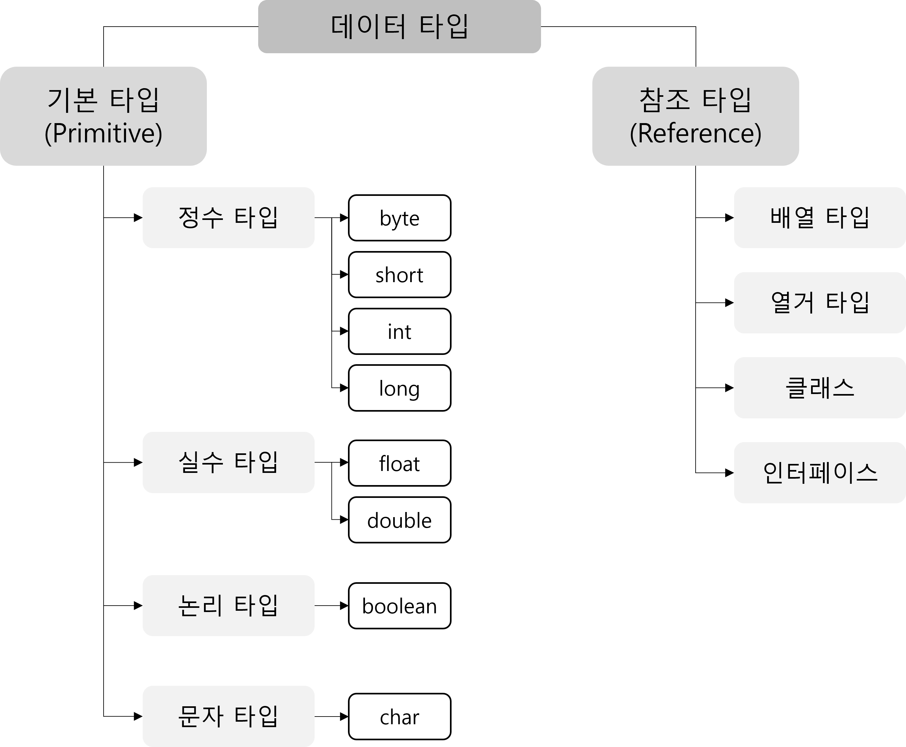
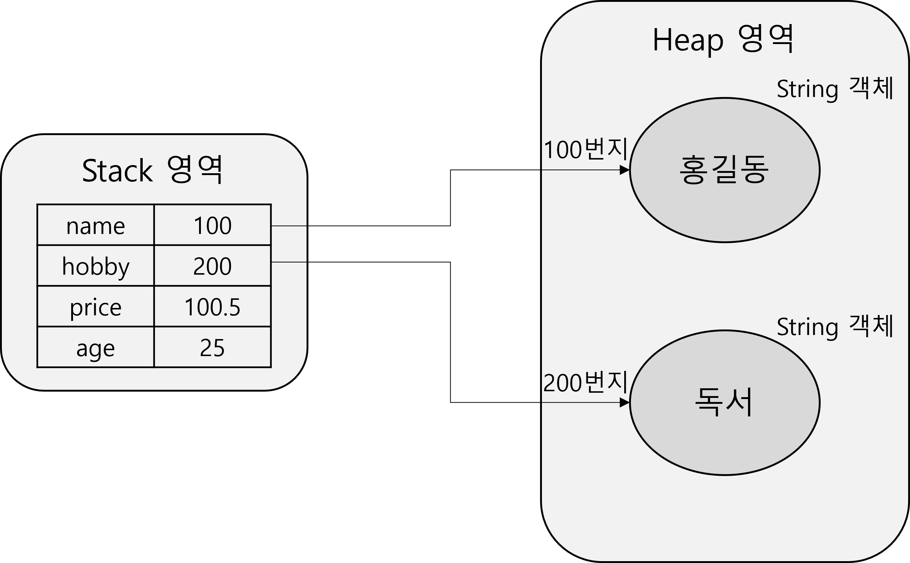
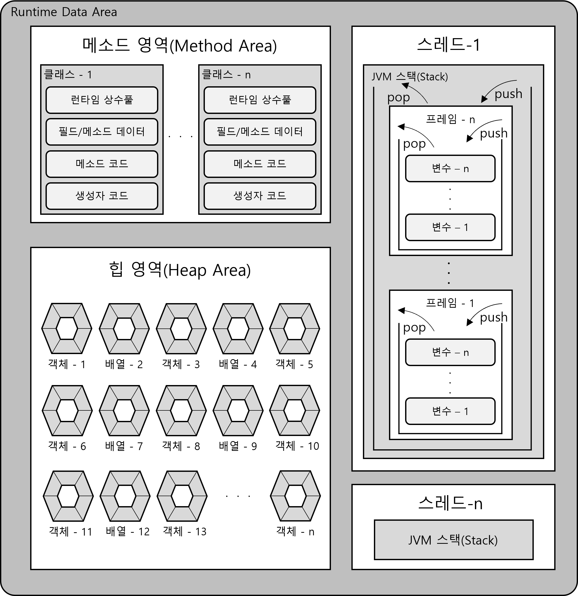
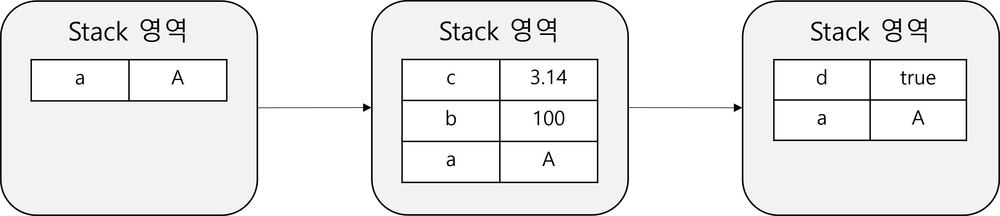
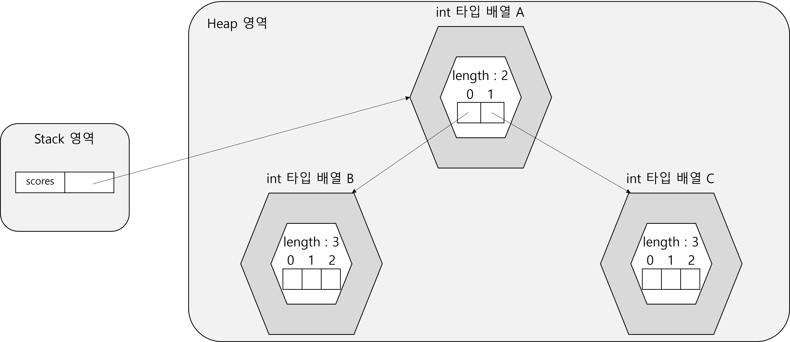
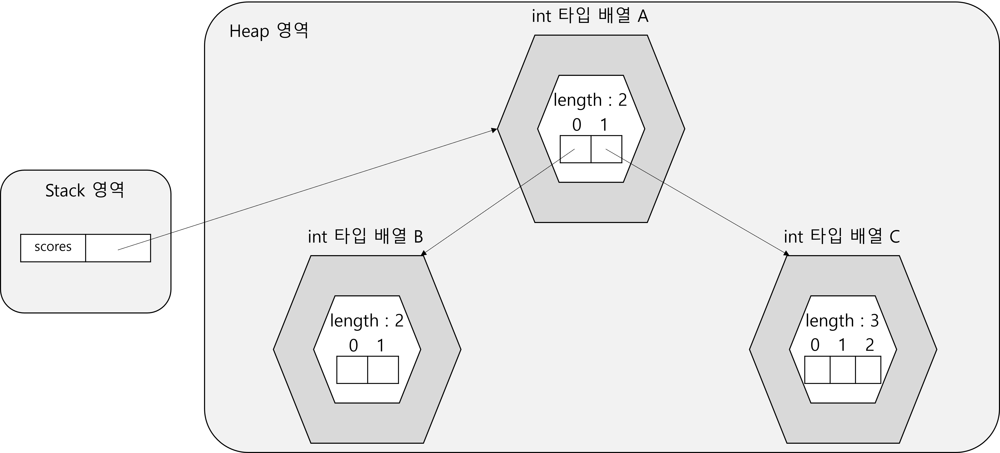
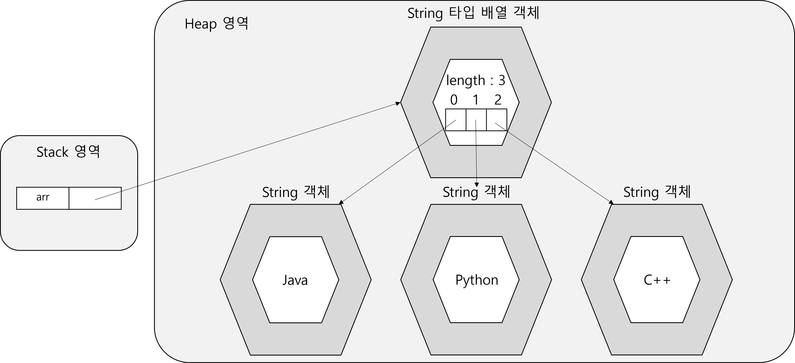

# Chapter 4. 참조 타입

## 4.1 데이터 타입 분류

### 4.1.1 데이터 타입 분류

- 데이터 타입 분류
    - 프로그램이 하는 일은 결국 데이터를 처리하는 것
      
        ⇒ 데이터를 얼마나 잘 다루느냐가 좋은 프로그램을 작성할 수 있는 관건이 됨
        
    - 데이터를 잘 다루기 위해서는 자바에서 지원하는 데이터 타입에 대해서 제대로 이해할 필요가 있음
    - 데이터 타입의 분류
        1. 기본 타입(Primitive Type) : 정수, 실수, 문자, 논리 리터럴
        2. 참조 타입(Reference Type) : 객체의 주소를 참조하는 타입 → 배열, 열거, 클래스, 인터페이스
        
        
        
    - 기본 타입과 참조 타입의 차이점 : 저장되는 값
        - 기본 타입 : 실제 값
        - 참조 타입 : 데이터의 주소 값
        - 예시
          
            ```java
            int age = 25;
            double price = 100.5;
            
            String name = "홍길동";
            String hobby = "독서";
            ```
            
            
            
            - 변수는 stack 영역에 생성
            - 객체는 heap 영역에 생성
            - `int`와 `double` 타입 변수는 직접 값을 stack 영역에 저장
            - `String` 타입 변수는 `heap` 영역의 주소 값을 stack 영역에 저장

## 4.2 메모리 사용 영역

### 4.2.1 JVM 메모리 영역

- JVM 메모리 영역
  
    
    
- 메소드 영역
    - 코드에서 사용되는 클래스들을 클래스 로더로 읽어 클래스별로 런타임 상수풀, 필드 데이터, 메소드 데이터, 메소드 코드, 생성자 코드 등을 분류해서 저장
    - JVM이 시작할 때 생성
    - 모든 스레드가 공유하는 영역
- 힙(Heap) 영역
    - 객체와 배열이 생성되는 영역
    - 힙 영역에 생성된 객체와 배열은 JVM 스택 영역의 변수나 다른 객체의 필드에서 참조
    - 참조하는 변수나 필드가 없다면 의미 없는 객체가 되어 쓰레기로 취급하고, JVM은 쓰레기 수집기(Garbage Collector)를 실행시켜 쓰레기 객체를 자동으로 제거
      
        ⇒ 개발자가 쓰레기 객체를 제거하기 위해 별도의 코드를 작성할 필요가 없음 (실제로 제거하는 방법이 제공되지도 않음)
    
- JVM 스택(Stack) 영역
    - 각 스레드마다 존재
    - 스레드가 시작될 때 할당됨
    - 추가적으로 스레드를 생성하지 않았다면 main 스레드만 존재하므로 JVM 스택도 하나
    - JVM 스택은 메소드를 호출할 때마다 프레임을 추가(push)하고, 종료되면 해당 프레임을 제거(pop)하는 동작 수행
    - 프레임 내부에는 로컬 변수 스택이 있음
    - 로컬 변수 스택에는 기본 타입 변수와 참조 타입 변수가 추가(push)되거나 제거(pop)됨
    - 변수가 로컬 변수 스택에 생성되는 시점 : 초기화될 때
    - 변수는 선언된 블록 안에서만 스택에 존재하고 블록을 벗어나면 스택에서 제거됨
    - 예시
      
        ```java
        char a = 'A';
        
        if (a == 'A'){
        	int b = 100;
        	double c = 3.41;
        }
        
        boolean d = true;
        ```
        
        
        

## 4.3 참조 변수의 동등 비교 연산

### 4.3.1 참조 변수 동등 비교

- 참조 변수의 동등 비교 연산
    - 기본 타입의 경우 값이 같은지 아닌지를 조사
    - 참조 타입의 경우 동일한 객체를 참조하는지 다른 객체를 참조하는지 비교
    - 동일한 주소 값을 갖고 있다는 것은 동일한 객체를 참조한다는 의미

## 4.4 null과 NullPointerException

### 4.4.1 null과 NullPointerException

- null
    - 참조 타입 변수는 객체를 참조하지 않았다는 뜻으로 `null` 값을 가질 수 있음
    - `null` 값은 초기 값으로도 사용 가능
- NullPointerException
    - 자바는 프로그램 실행 중 발생하는 오류를 예외라고 부름
    - 참조 변수를 사용하면서 가장 많이 발생하는 예외 중 하나가 `NullPointerException`
    - `NullPointerException` : 참조 타입 변수가 `null`을 가지고 있을 경우 발생하는 예외

## 4.5 String 타입

### 4.5.1 String 타입

- String 타입
    - 문자열은 `String` 타입 변수에 저장
    - 문자열 리터럴은 큰 따옴표 `""`로 감싸서 표현
    - 문자열이 직접 변수에 저장되는 것이 아니라 `String` 객체로 생성되고 변수는 해당 객체를 참조하는 것
    - 문자열 리터럴이 동일하다면 동일한 객체를 참조
      단, `new` 연산자를 이용해 문자열이 같아도 새로운 객체를 생성했다면 다른 객체를 참조하게 되는 것
        - `new` : 힙(heap) 영역에 새로운 객체를 만들 때 사용하는 연산자
    - 문자열에 대한 동등 비교(`==`, `!=`)는 참조 주소가 같은지 판별
      
        ⇒ 문자열 내용이 같아도 참조 객체가 다르면 같지 않다고 판별
        
    - 문자열이 어떤 객체를 참조하는지 상관없이 문자열 내용이 같은지 비교하려면 `equals()` 메소드 사용
- 문자열 비교 예제
  
    ```java
    package sec05;
    
    public class StringTest {
    
    	public static void main(String[] args) {
    
    		String name1 = "홍길동";
    		String name2 = "홍길동"; // name1과 name2는 같은 객체 참조
    
    		// 같은 객체를 참조하는지 판별
    		if (name1 == name2) {
    			System.out.println("name1과 name2는 같은 객체 참조");
    		} else {
    			System.out.println("name1과 name2는 다른 객체 참조");
    		}
    
    		// 문자열 내용이 같은지 판별
    		if (name1.equals(name2)) {
    			System.out.println("name1과 name2의 내용이 같음");
    		} else {
    			System.out.println("name1과 name2의 내용이 다름");
    		}
    
    		String name3 = new String("홍길동");
    		String name4 = new String("홍길동"); // name3과 name4는 각자의 객체를 생성하여 참조
    
    		// 같은 객체를 참조하는지 판별
    		if (name3 == name4) {
    			System.out.println("name3과 name4는 같은 객체 참조");
    		} else {
    			System.out.println("name3과 name4는 다른 객체 참조");
    		}
    
    		// 문자열 내용이 같은지 판별
    		if (name3.equals(name4)) {
    			System.out.println("name3과 name4의 내용이 같음");
    		} else {
    			System.out.println("name3과 name4의 내용이 다름");
    		}
    
    	}
    
    }
    ```
    
    - 결과
      
        ```
        name1과 name2는 같은 객체 참조
        name1과 name2의 내용이 같음
        name3과 name4는 다른 객체 참조
        name3과 name4의 내용이 같음
        ```
        

## 4.6 배열 타입

### 4.6.1 배열이란?

- 배열
    - 변수는 1개의 데이터만 저장 가능
      
        ⇒ 저장할 데이터의 수가 많아지면 그만큼의 변수가 필요해짐
        
        ⇒ 필요한 변수를 하나씩 전부 입력하면 매우 비효율적
        
    - 배열은 같은 타입의 데이터를 연속된 공간에 나열시키고 각 데이터에 인덱스(Index)를 부여해 놓은 자료구조
    - 같은 타입의 데이터만 저장 가능
    - 배열은 선언과 동시에 저장 가능한 데이터 타입이 결정됨
    - 설정한 데이터 타입과 다른 타입의 데이터를 저장할 경우 컴파일 오류(Type mismatch) 발생
    - 배열 길이 수정 불가
      
        ⇒ 배열 길이를 수정해야 할 경우 수정할 길이의 배열을 새로 생성한 후 기존에 입력한 데이터를 복사해야 함
        
    - 배열을 객체로 취급하여 생성 시 `new` 예약어 사용
    - 배열의 요소를 참조할 때 배열의 이름과 index 사용
    - index는 정수

### 4.6.2 배열 선언

- 배열 선언
    - 배열을 사용하기 위해 배열 변수를 선언해야 함
    - 선언 방법
        1. `데이터  타입[] 배열명;`
        2. `데이터 타입 배열명[];`
    - 배열도 객체
      
        ⇒ 힙 영역에 생성되고 배열명이 힙 영역의 배열 객체를 참조하는 구조
        

### 4.6.3 값 목록으로 배열 생성

- 값 목록으로 배열 생성
    - 구문
      
        ```java
        데이터 타입[] 배열명 = {값0, 값1, 값2, ...};
        ```
        
    - 배열을 선언한 후 목록으로 값 입력은 불가
      `new` 연산자로 객체를 생성한 후 입력해야 함
      
        ```java
        데이터 타입[] 배열명;
        배열명 = {값0, 값1, ...}; // 컴파일 에러
        배열명 = new 데이터타입[] {값0, 값1, ...};
        ```
    
- 값 목록으로 배열 생성 예제
    1. 예제 1
       
        ```java
        package sec06;
        
        public class ArrayTest1 {
        
        	public static void main(String[] args) {
        
        		// 점수 저장 객체 생성
        		int[] scores = { 83, 90, 87 };
        
        		// 배열에 저장된 값 출력
        		System.out.println("scores[0] : " + scores[0]);
        		System.out.println("scores[1] : " + scores[1]);
        		System.out.println("scores[2] : " + scores[2]);
        
        		// 합을 저장할 변수 생성
        		int sum = 0;
        
        		// sum 변수에 값을 더하는 반복문
        		for (int i = 0; i < 3; i++) {
        			sum += scores[i];
        		}
        
        		// 결과 출력
        		System.out.println("총합 : " + sum);
        
        		// 평균 계산
        		double avg = (double) sum / 3;
        
        		// 결과 출력
        		System.out.println("평균 : " + avg);
        
        	}
        
        }
        ```
        
        - 결과
          
            ```
            scores[0] : 83
            scores[1] : 90
            scores[2] : 87
            총합 : 260
            평균 : 86.66666666666667
            ```
        
    2. 예제 2
       
        ```java
        package sec06;
        
        public class ArrayTest2 {
        
        	public static void main(String[] args) {
        
        		// 점수를 저장할 배열 선언
        		int[] scores;
        
        		// 객체를 생성한 후 값 저장
        		scores = new int[] { 83, 90, 87 };
        
        		// 반복문으로 합 결과를 저장할 변수 생성
        		int sum1 = 0;
        
        		// 반복문으로 배열 요소 총합 계산
        		for (int i = 0; i < 3; i++) {
        			sum1 += scores[i];
        		}
        
        		// 반복문으로 구한 총합 출력
        		System.out.println("총합 : " + sum1);
        
        		// 정의한 메소드로 합의 결과를 저장할 변수 생성
        		int sum2 = add(new int[] { 83, 90, 87 });
        
        		// 메소드로 구한 총합 출력
        		System.out.println("총합 : " + sum2);
        
        	}
        
        	// 합을 구하는 메소드 정의
        	public static int add(int[] scores) {
        		int sum = 0;
        		for (int i = 0; i < 3; i++) {
        			sum += scores[i];
        		}
        		return sum;
        	}
        
        }
        ```
        
        - 결과
          
            ```
            총합 : 260
            총합 : 260
            ```
            

### 4.6.4 new 연산자로 배열 생성

- new 연산자로 배열 생성
    - 값의 목록은 없지만 향후 값을 저장할 것을 대비해 미리 배열을 선언할 때 사용
    - `new`연산자로 배열을 처음 생성할 경우 자동적으로 기본값으로 초기화됨
    - 기본값
      
      
        | 데이터 타입 | 초기값 |
        | --- | --- |
        | byte[] | 0 |
        | char[] | '\u0000’ |
        | short[] | 0 |
        | int[] | 0 |
        | long[] | 0L |
        | float[] | 0.0F |
        | double[] | 0.0 |
        | boolean[] | false |
        | 클래스[] | null |
        | 인터페이스[] | null |
- new 연산자 예제
  
    ```java
    package sec06;
    
    public class ArrayTest3 {
    
    	public static void main(String[] args) {
    
    		// 정수 타입 배열 1 생성
    		int[] arr1 = new int[3];
    
    		// 초기 상태 출력
    		for (int i = 0; i < 3; i++) {
    			System.out.println("arr1[" + i + "] : " + arr1[i]);
    		}
    
    		// 인덱스별 데이터 입력
    		arr1[0] = 10;
    		arr1[1] = 20;
    		arr1[2] = 30;
    
    		// 데이터 입력 후 상태 출력
    		for (int i = 0; i < 3; i++) {
    			System.out.println("arr1[" + i + "] : " + arr1[i]);
    		}
    
    		// 실수 타입 배열 2 생성
    		double[] arr2 = new double[3];
    
    		// 초기 상태 출력
    		for (int i = 0; i < 3; i++) {
    			System.out.println("arr2[" + i + "] : " + arr2[i]);
    		}
    
    		// 인덱스별 데이터 입력
    		arr2[0] = 0.1;
    		arr2[1] = 0.2;
    		arr2[2] = 0.3;
    
    		// 데이터 입력 후 출력
    		for (int i = 0; i < 3; i++) {
    			System.out.println("arr2[" + i + "] : " + arr2[i]);
    		}
    
    		// 문자열 타입 배열 3 생성
    		String[] arr3 = new String[3];
    
    		// 초기 상태 출력
    		for (int i = 0; i < 3; i++) {
    			System.out.println("arr3[" + i + "] : " + arr3[i]);
    		}
    
    		// 인덱스별 데이터 입력
    		arr3[0] = "1월";
    		arr3[1] = "2월";
    		arr3[2] = "3월";
    
    		// 데이터 입력 후 상태 출력
    		for (int i = 0; i < 3; i++) {
    			System.out.println("arr3[" + i + "] : " + arr3[i]);
    		}
    
    	}
    
    }
    ```
    
    - 결과
      
        ```
        arr1[0] : 0
        arr1[1] : 0
        arr1[2] : 0
        arr1[0] : 10
        arr1[1] : 20
        arr1[2] : 30
        arr2[0] : 0.0
        arr2[1] : 0.0
        arr2[2] : 0.0
        arr2[0] : 0.1
        arr2[1] : 0.2
        arr2[2] : 0.3
        arr3[0] : null
        arr3[1] : null
        arr3[2] : null
        arr3[0] : 1월
        arr3[1] : 2월
        arr3[2] : 3월
        ```
        

### 4.6.5 배열 길이

- 배열 길이
    - 배열에 저장할 수 있는 항목 수
    - 배열의 길이를 얻으려면 `length` 필드를 읽으면 됨
        - 필드 : 객체 내부의 데이터
        - 예시
          
            ```java
            arr.length;
            ```
        
    - `length` 필드는 읽기 전용으로 수정 불가
    - 반복문 조건식 작성 시 유용함
- `length` 필드 예제
  
    ```java
    package sec06;
    
    public class ArrayTest4 {
    
    	public static void main(String[] args) {
    
    		// 배열 생성
    		int[] scores = { 83, 90, 87 };
    
    		// 합을 저장할 변수 생성
    		int sum = 0;
    
    		// 인덱스별 데이터를 sum에 더하는 반복문
    		// 조건식에 length 필드 적용
    		for (int i = 0; i < scores.length; i++) {
    			sum += scores[i];
    		}
    
    		// 결과 출력
    		System.out.println("총합 : " + sum);
    
    		// 평균 계산
    		double avg = (double) sum / scores.length;
    
    		// 결과 출력
    		System.out.println("평균 : " + avg);
    
    	}
    
    }
    ```
    
    - 결과
      
        ```
        총합 : 260
        평균 : 86.66666666666667
        ```
        

### 4.6.6 커맨드 라인 입력

- 커맨드 라인 입력
    - java 클래스로 프로그램을 실행하면 JVM은 길이가 0인 `String` 배열을 먼저 생성하고 메인 메소드를 호출할 때 매개값으로 전달
    - 메인 메소드에 매개값을 주고 실행하려면 [Run] - [Run Configurations...] - [Arguments] 에서 값을 입력하고 실행

### 4.6.7 다차원 배열

- 다차원 배열
    - 행과 열로 구성된 배열
    - 수학의 행렬을 떠올리면 됨
    - 가로 인덱스와 세로 인덱스를 사용
    - 메모리 예제
      
        ```java
        int[][] scores = new int[2][3];
        ```
        
        
        
        - 배열 scores는 길이 2(행의 길이)인 배열 A 참조
        - 배열 A의 scores[0]는 길이 3(열의 길이)인 배열 B 참조
        - 배열 A의 scores[1]은 길이 3인 배열 C 참조
        - scores[0], scores[1] 모두 배열을 참조하는 변수 역할
          
            ```java
            scores.length // 2(배열 A의 길이)
            scores[0].length // 3(배열 B의 길이)
            scores[1].length // 3(배열 C의 길이)
            ```
        
    - 일차원 배열이 서로 연결된 구조로 다차원 배열을 구현
      
        ⇒ 계단식 구조를 가질 수 있음
        
        ```java
        int[][] scores = new int[2][];
        scores[0] = new int[2];
        scores[1] = new int[3];
        ```
        
        
        
        ```java
        scores.length // 2(배열 A의 길이)
        scores[0].length // 2(배열 B의 길이)
        scores[1].length // 3(배열 C의 길이)
        ```
    
- 다차원 배열 예제
  
    ```java
    package sec06;
    
    public class ArrayTest5 {
    
    	public static void main(String[] args) {
    
    		// 수학 점수를 저장할 2차원 배열 생성
    		int[][] mathScores = new int[2][3];
    
    		// 반복문을 이용하여 배열 상태 출력
    		for (int i = 0; i < mathScores.length; i++) {
    			for (int k = 0; k < mathScores[i].length; k++) {
    				System.out.println("mathScores[" + i + "][" + k + "]=" + mathScores[i][k]);
    			}
    		}
    
    		System.out.println();
    
    		// 영어 점수를 저장할 2차원 배열 생성
    		int[][] englishScores = new int[2][];
    
    		// 1행에 길이 2인 배열 생성
    		englishScores[0] = new int[2];
    
    		// 2행에 길이 3인 배열 생성
    		englishScores[1] = new int[3];
    
    		// 반복문을 이용하여 배열 상태 출력
    		for (int i = 0; i < englishScores.length; i++) {
    			for (int k = 0; k < englishScores[i].length; k++) {
    				System.out.println("englishScores[" + i + "][" + k + "]=" + englishScores[i][k]);
    			}
    		}
    
    		System.out.println();
    
    		// 자바 점수를 저장할 2차원 배열 생성 및 값 저장
    		int[][] javaScores = { { 95, 80 }, { 92, 96, 80 } };
    
    		// 반복문을 이용하여 배열 상태 출력
    		for (int i = 0; i < javaScores.length; i++) {
    			for (int k = 0; k < javaScores[i].length; k++) {
    				System.out.println("javaScores[" + i + "][" + k + "]=" + javaScores[i][k]);
    			}
    		}
    
    	}
    
    }
    ```
    
    - 결과
      
        ```
        mathScores[0][0]=0
        mathScores[0][1]=0
        mathScores[0][2]=0
        mathScores[1][0]=0
        mathScores[1][1]=0
        mathScores[1][2]=0
        
        englishScores[0][0]=0
        englishScores[0][1]=0
        englishScores[1][0]=0
        englishScores[1][1]=0
        englishScores[1][2]=0
        
        javaScores[0][0]=95
        javaScores[0][1]=80
        javaScores[1][0]=92
        javaScores[1][1]=96
        javaScores[1][2]=80
        ```
        

### 4.6.8 객체를 참조하는 배열

- 객체를 참조하는 배열
    - 기본 타입 배열은 각 항목에 직접 값을 저장
    - 참조 타입 배열은 각 항목에 객체의 주소값을 저장
    - 예시
        - `String`은 클래스 타입이므로 `String[]` 배열은 각 항목에 문자열이 아니라 객체의 주소가 저장됨
        
        ```java
        String[] arr = new String[3];
        
        arr[0] = "Java";
        arr[1] = "Python";
        arr[2] = "C++";
        ```
        
        
        
        ```java
        String[] arr2 = new String[3];
        
        arr2[0] = "Java";
        arr2[1] = "Java";
        arr2[2] = new String("Java");
        
        System.out.println(arr2[0] == arr2[1]); // true(같은 객체 참조)
        System.out.println(arr2[1] == arr2[2]); // false(다른 객체 참조)
        System.out.println(arr2[0].equals(arr2[2])); // true(같은 문자열)
        ```
    
- 객체를 참조하는 배열 예제
  
    ```java
    package sec06;
    
    public class ArrayTest6 {
    
    	public static void main(String[] args) {
    
    		// 배열 객체 생성
    		String[] strArray = new String[3];
    
    		// 인덱스별 객체 저장
    		strArray[0] = "Java";
    		strArray[1] = "Java";
    		strArray[2] = new String("Java");
    
    		System.out.println(strArray[0] == strArray[1]); // 같은 객체를 참조하므로 true
    		System.out.println(strArray[0] == strArray[2]); // 다른 객체를 참조하므로 false
    		System.out.println(strArray[0].equals(strArray[2])); // 문자열은 같으므로 true
    
    	}
    
    }
    ```
    
    - 결과
      
        ```
        true
        false
        true
        ```
        

### 4.6.9 배열 복사

- 배열 복사
    - 한 번 생성한 배열은 수정이 불가하므로 더 많은 저장 공간이 필요하다면 더 큰 배열을 새로 생성한 후 데이터들을 복사해야 함
    - 값을 복사하는 방법
        1. 반복문 사용
        2. `System.arraycopy()` 메소드 사용
    - `System.arraycopy()` 메소드 구문
      
        ```java
        System.arraycopy(Object src, int srcPos, Object dest, int destPos, int length);
        ```
        
        - `src` : 원본 배열
        - `srcPos` : 복사 시작 인덱스 번호
        - `dest` : 붙여넣을 배열
        - `destPos` : 붙여넣기 시작 인덱스 번호
        - `length` : 복사할 인덱스 개수
- 배열 복사 예제
    1. 예제 1 - for문 활용
       
        ```java
        package sec06;
        
        public class ArrayTest7 {
        
        	public static void main(String[] args) {
        
        		// 원본 배열 생성
        		int[] oldIntArray = { 1, 2, 3 };
        
        		// 붙여넣을 배열 생성
        		int[] newIntArray = new int[5];
        
        		// 원본 배열 데이터를 새로운 배열에 붙여넣는 반복문
        		for (int i = 0; i < oldIntArray.length; i++) {
        			newIntArray[i] = oldIntArray[i];
        		}
        
        		// 결과 출력
        		for (int i = 0; i < newIntArray.length; i++) {
        			System.out.print(newIntArray[i] + ", ");
        		}
        
        	}
        
        }
        ```
        
        - 결과
          
            ```
            1, 2, 3, 0, 0, // int 타입 배열이라 데이터가 없는 곳은 초기값 0
            ```
        
    2. 예제 2 - `System.arraycopy()` 활용
       
        ```java
        package sec06;
        
        public class ArrayTest8 {
        
        	public static void main(String[] args) {
        
        		// 원본 배열 생성
        		String[] oldStrArray = { "java", "array", "copy" };
        
        		// 붙여 넣을 배열 생성
        		String[] newStrArray = new String[5];
        
        		// 복사하는 메소드 실행
        		System.arraycopy(oldStrArray, 0, newStrArray, 0, oldStrArray.length);
        
        		// 결과 출력
        		for (int i = 0; i < newStrArray.length; i++) {
        			System.out.print(newStrArray[i] + ", ");
        		}
        
        	}
        
        }
        ```
        
        - 결과
          
            ```
            java, array, copy, null, null, // String 타입 배열이라 데이터가 없는 곳은 초기값 null
            ```
            

### 4.6.10 향상된 for문

- 향상된 for문
    - 반복 실행을 하기 위해 카운터 변수와 증감식을 사용하지 않는 반복문
    - 배열 및 컬렉션 항목의 개수만큼 반복하고 자동적으로 for문을 빠져나감
    - 인덱스 대신 직접 변수에 접근
    - 원본 수정은 불가하고 읽기만 가능한 기능 제공
    - 구문
      
        ```java
        for (데이터 타입 변수명 : 배열명){
        	실행문;
        }
        ```
        
    - 실행 과정
        1. 배열에서 가져올 첫 번재 값이 존재하는지 평가
        2. 가져올 값이 있으면 변수에 값을 저장
        3. 실행문 실행
        4. 다음 값이 존재하는지 평가하여 반복을 진행하거나 종료함
- 향상된 for문(for-each) 예제
  
    ```java
    package sec06;
    
    public class ForEachTest {
    
    	public static void main(String[] args) {
    
    		// 점수 저장 배열 생성
    		int[] scores = { 95, 71, 84, 93, 87 };
    
    		// 총합을 저장할 변수 생성
    		int sum = 0;
    
    		// 향상된 반복문
    		for (int score : scores) {
    			sum = sum + score;
    		}
    
    		// 결과 출력
    		System.out.println("점수 총합 = " + sum);
    
    		// 평균 계산
    		double avg = (double) sum / scores.length;
    
    		// 결과 출력
    		System.out.println("점수 평균 = " + avg);
    
    	}
    
    }
    ```
    
    - 결과
      
        ```
        점수 총합 = 430
        점수 평균 = 86.0
        ```
        

## 4.7 열거 타입

### 4.7.1 열거 타입 선언

- 열거 타입
    - 데이터 중에는 몇 가지로 한정된 값만을 갖는 경우가 흔히 있음(요일, 계절 등)
    - 열거 타입 : 한정된 값만 갖는 데이터 타입
    - 열거 타입은 열거 상수 중에서 하나의 상수를 저장하는 데이터 타입
- 선언
    - 열거 타입의 이름을 정하고 열거 타입 이름으로 소스 파일을 생성해야 함
    - 열거 타입 이름은 관례적으로 첫 문자를 대문자로 하고 나머지는 소문자로 구성
    - 여러 단어로 구성된 이름은 camel case 적용
    - 열거 타입을 선언하기 위한 키워드 : `public enum`
    - 열거 상수는 모두 대문자로 작성
    - 예시
      
        ```java
        public enum Week{
        	MONDAY,
        	TUESDAY,
        	WENDESDAY,
        	THURSDAY,
        	FRIDAY,
        	SATURDAY,
        	SUNDAY
        }
        ```
        

### 4.7.2 열거 타입 변수

- 열거 타입 변수 예제
  
    ```java
    package sec07;
    
    import java.util.Calendar;
    
    public class EnumWeekTest {
    
    	public static void main(String[] args) {
    
    		Week today = null;
    
    		Calendar cal = Calendar.getInstance();
    		int week = cal.get(Calendar.DAY_OF_WEEK);
    
    		switch (week) {
    		case 1:
    			today = Week.SUNDAY;
    			break;
    		case 2:
    			today = Week.MONDAY;
    			break;
    		case 3:
    			today = Week.TUESDAY;
    			break;
    		case 4:
    			today = Week.WEDNESDAY;
    			break;
    		case 5:
    			today = Week.THURSDAY;
    			break;
    		case 6:
    			today = Week.FRIDAY;
    			break;
    		case 7:
    			today = Week.SATURDAY;
    			break;
    		}
    
    		System.out.println("오늘 요일: " + today);
    
    		if (today == Week.SUNDAY) {
    			System.out.println("일요일에는 축구를 합니다.");
    		} else {
    			System.out.println("열심히 자바 공부합니다.");
    		}
    
    	}
    
    }
    ```
    
    - 결과
      
        ```
        오늘 요일: SATURDAY
        열심히 자바 공부합니다.
        ```
        

### 4.7.3 열거 객체의 메소드

- 열거 객체의 메소드
  
  
    | 리턴 타입 | 메소드명 | 의미 |
    | --- | --- | --- |
    | String | name() | 열거 객체의 문자열 리턴 |
    | int | ordinal() | 열거 객체의 순번 리턴 |
    | int | compareTo() | 열거 객체를 비교해서 순번 리턴 |
    | 열거 타입 | valueOf(String name) | 주어진 문자열의 열거 객체를 리턴 |
    | 열거 배열 | values() | 모든 열거 객체들을 배열로 리턴 |
- 열거 객체 메소드 예제
  
    ```java
    package sec07;
    
    public class EnumMethodTest {
    
    	public static void main(String[] args) {
    
    		// name() 메소드
    		Week today = Week.SUNDAY;
    		String name = today.name();
    
    		System.out.println(name);
    
    		// ordinal() 메소드
    		int ordinal = today.ordinal();
    
    		System.out.println(ordinal);
    
    		// compareTo() 메소드
    		Week day1 = Week.MONDAY;
    		Week day2 = Week.WEDNESDAY;
    
    		int result1 = day1.compareTo(day2);
    		int result2 = day2.compareTo(day1);
    
    		System.out.println(result1);
    		System.out.println(result2);
    
    		// valueOf() 메소드
    		/*
    		 * Week weekDay = Week.valueOf("SUNDAY"); if(weekDay == Week.SATURDAY || weekDay
    		 * == Week.SUNDAY) { System.out.println("주말 이군요"); } else {
    		 * System.out.println("평일 이군요"); }
    		 */
    
    		if (args.length == 1) {
    			String strDay = args[0];
    			Week weekDay = Week.valueOf(strDay);
    
    			if (weekDay == Week.SATURDAY || weekDay == Week.SUNDAY) {
    				System.out.println("주말 이군요");
    			} else {
    				System.out.println("평일 이군요");
    			}
    		}
    
    		// values() 메소드
    		Week[] days = Week.values();
    		for (Week day : days) {
    			System.out.println(day);
    		}
    
    	}
    
    }
    ```
    
    - 결과
      
        ```
        SUNDAY
        6
        -2
        2
        MONDAY
        TUESDAY
        WEDNESDAY
        THURSDAY
        FRIDAY
        SATURDAY
        SUNDAY
        ```
        

---